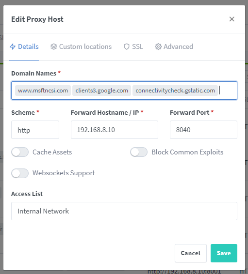

# Online Checker

Windows and Android devices perform certain checks whenever they connect to a Wifi network to determine whether or not the network has access to the internet. If no internet access is available, they are prone to just disconnect from the wifi (immediately or after some time). This can be very annoying if you've brought the Wifi with you and have provided certain services inside of that Wifi network, so that your guests/family can enjoy them. Think about services like Jellyfin or Plex.

This service aims to ensure that the devices can perform their connectivity check and stay connected.

## Usage

To run the container, use the following command:

``` bash

```

or use the included `docker-compose.yml` file to spin up the container.

Change your internal DNS redirects to ensure that `www.msftncsi.com` points to the container and that your reverse proxy server translates the FQDN to the container:



If your running an internal DNS server like AdGuard, you should also ensure that the following records exist:

- `dns.msftncsi.com` resolves to `131.107.255.255`
- `clients3.google.com` resolves to your container
- `www.msftncsi.com` resolves to your container
- `connectivitycheck.gstatic.com` resolves to your container


## Documentation

### Windows

Windows does indeed check a Microsoft site for connectivity, using the Network Connectivity Status Indicator site (NCSI). There are a few variations of the connection checking process:

NCSI performs a DNS lookup on `www.msftncsi.com`, then requests `http://www.msftncsi.com/ncsi.txt`. This file is a plain-text file and contains only the text `Microsoft NCSI`.

1. NCSI sends a DNS lookup request for `dns.msftncsi.com`. This DNS address should resolve to `131.107.255.255`. If the address does not match, then it is assumed that the internet connection is not functioning correctly.

2. The exact sequence of when which test is run is not documented; however, a little bit of digging around with a packet sniffing tool like Wireshark reveals some info. It appears that on any connection, the first thing NCSI does is requests the text file (step 1 above). NCSI expects a 200 OK response header with the proper text returned. If the response is never received, or if there is a redirect, then a DNS request for dns.msftncsi.com is made. If DNS resolves properly but the page is inaccessible, then it is assumed that there is a working internet connection, but an in-browser authentication page is blocking access to the file. This results in the pop-up balloon above. If DNS resolution fails or returns the wrong address, then it is assumed that the internet connection is completely unsuccessful, and the “no internet access” error is shown.

The order of events appears to be slightly different depending on whether the wireless network is saved, has been connected to before even if it is not in the saved connections list, and possibly depending on the encryption type. The DNS and HTTP requests and responses showing up in Wireshark were not always consistent, even connecting to the same network, so it’s not entirely clear what causes different methods of detection under different scenarios.

### Android / Chromium

Shill, the connection manager for Chromium OS, attempts to detect services that are within a captive portal whenever a service transitions to the ready state. This determination of being in a captive portal or being online is done by attempting to retrieve the webpage `http://clients3.google.com/generate_204`. This well known URL is known to return an empty page with an HTTP status 204. If for any reason the web page is not returned, or an HTTP response other than 204 is received, then shill marks the service as being in the portal state.
